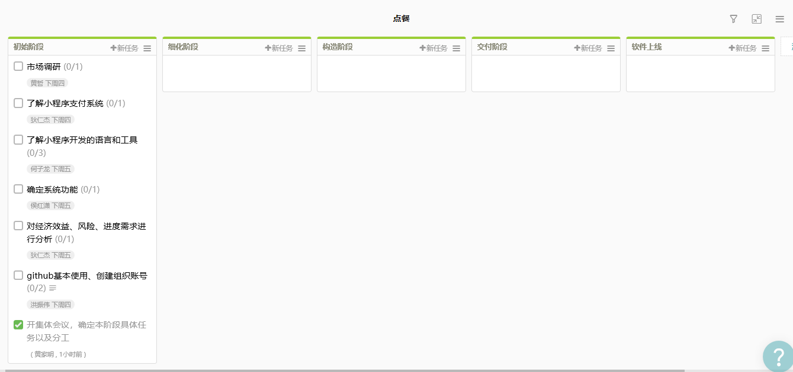

1. 简答题
   - 简述瀑布模型、增量模型、螺旋模型（含原型方法）的优缺点。
     * 瀑布模型
       + 优点：降低软件开发的复杂程度，提高软件开过程的透明性，提高软件开发过程的可管理性；推迟软件实现，强调在软件实现前必须进行分析和设计工作。
       + 缺点：强调过程活动的线性顺序；缺乏灵活性，特别是无法解决软件需求不明确或不准确的问题；风险控制能力较弱；软件活动是文档驱动的，当阶段之间规定过多的文档时，会极大地增加系统的工作量。
     * 增量模型
       + 优点：增强客户对系统的信心；降低系统失败风险；提高系统可靠性；提高系统的稳定性和可维护性。
       + 缺点：增量粒度难以选择；确定所有的基本业务服务比较困难。
     * 螺旋模型
       + 优点：以小的分段来构建大型系统，使成本计算变得简单容易；客户始终参与每个阶段的开发，保证了项目不偏离正确方向以及项目的可控性。
       + 缺点：很难让用户确信这种演化方法的结果是可以控制的。建设周期长，而软件技术发展比较快，所以经常软件开发完毕后，和当前的技术水平有个较大的差距，无法满足当前用户需求。

   - 简述UP的三大特点，其中哪些内容体现了用户驱动的开发，哪些内容体现风险驱动的开发？

     三大特点：基于UML；以构架为中心；用例驱动与风险驱动相结合的迭代增量过程。

     其中用例驱动的迭代增量开发方式体现了用户驱动的开发。

     而以架构为中心，意味着早期迭代要致力于核心架构的构造、测试和稳定，体现了风险驱动的开发。

   - UP四个阶段的划分准则是什么？关键的里程碑是什么？
     * 初始阶段：大体上的构想、业务案列、范围和模糊评估。生命周期目标里程碑。
     * 细化阶段：已精华的构想、核心架构的迭代实现、高风险的解决、确定大多数需求和范围以及进行更为实际的评估。生命周期体系结构里程碑。
     * 构造阶段：对遗留下来的风险较低和比较简单的元素进行迭代实现，准备部署。初始运行能力里程碑。
     * 移交阶段：进行beta测试和部署。产品发布里程碑。

   - IT项目管理中，“工期、质量、范围/内容”三个元素中，在合同固定条件下，为什么说“范围/内容”是项目团队最易于控制的。
     **工期**是指约定的完成IT项目工程的时间，经常会在项目中被更改，不易于控制。

     **质量**的定义是与软件产品满足规定的和隐含的需要的能力有关的特征或特性的组合。质量是难以量化和确切衡量的，合同中对质量的约束也是较为宽泛的，一般难于控制。

     **项目范围**一般包括产品范围和项目范围。产品范围即产品或服务所包含的特征或功能；项目范围即为交付具有规定特征和功能的产品或服务所必须完成的工作。这些是易于团队控制的。

   - 为什么说，UP为企业按固定节奏生产、固定周期发布软件产品提供了依据？
     UP中，软件开发生命周期根据时间（**固定周期发布**）和UP的核心工作流（**固定节奏生产**）划分为二维空间。时间维从组织管理的角度描述整个软件开发生命周期，是UP的动态组成部分。它可以进一步描述为周期、阶段、迭代。核心工作流从技术角度描述UP的静态组成部分，它可进一步描述为行为、工作流、产品、角色。

2. 项目管理使用
   + 个人任务
     

   + 团队看板
     

