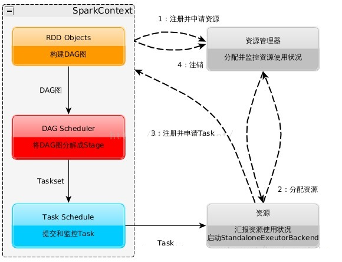
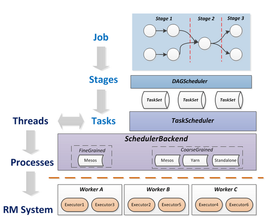

### 2. With respect to the goals of efficiency/performance.. what do you think are problems of adopting a very high level of abstraction in a programming system? What about potential benefits?
+ 抽象层次越高，意味着越远离系统底层实现，一定程度上会降低效率和性能。同时如果太抽象，一层包裹一层，一层嵌套一层，就会丢失和覆盖一些原有的特性和功能。
+ 当然抽象也有好处。更高级的抽象，意味着将更多相同的模型提取出来，能一定程度的避免重复。同时越高级的抽象，程序员越容易使用，简化编程。

---

### 3. Choose a popular parallel programming system(for example MapReduce, Spark, or Cilk)and try and describe its programming model(how are communication and execution expressed?)
+ Spark架构的组成  
     
   + Cluster Manager: 集群的资源管理器，监控worker。在Standalone模式中为Master主节点
   + worker节点: 负责控制计算，启动Executor 或 Driver
   + Driver: 运行Apllication的main函数
   + Executor: 执行器，是某个Apllication运行在worker node上的一个进程，采用多线程模型，将运算结果存储在内存或HDFS

+ Spark运行流程图  
   
   + 构建Spark运行环境，启动SparkContext
   + SparkContext向资源管理器申请运行Executor资源
   + Executor向SparkContext申请Task
   + SparkContext构建DAG图，将DAG图分解为stage，将Taskset发送给Task Schedule，最后由Task Schedule将Task发送给Executor运行

+ 关于Spark中的Job、Stage、Task
  