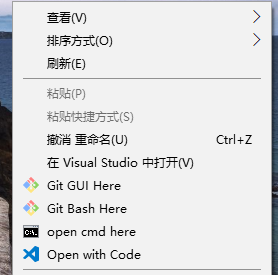
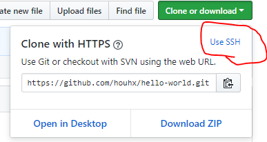
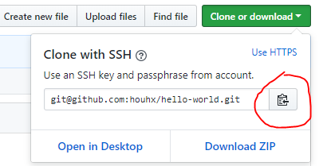
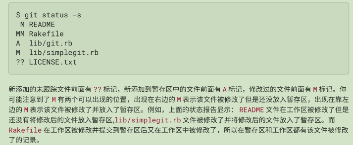
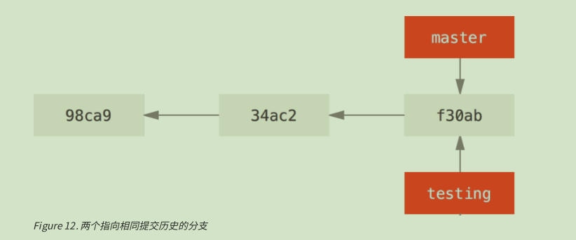
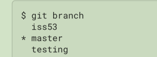

# 下载Git
+ 去[git](https://git-scm.com/)官网，下载Windows相应版本的Git
+ 最好装Setup版的，因为Portable的占用空间比较大，具体原因[见这](https://www.cnblogs.com/leading/archive/2012/03/02/better-not-use-git-for-windows-portable.html)
+ 装成功后，在桌面右键鼠标应该是这样,有GUI和Bash两个选项:

# 初次运行Git前的配置  
查看所有配置:  

    git config -l

查看某一项配置：  

    git config user.name
    git config user.email
    ···

## 用户信息  
安装完git后第一件事就是设置你的用户名和邮件地址（最好使用和你github一样的邮箱，不然要添加关联）。因为每一次git的提交都会使用这些信息。

    git config --global user.name yourname  
    git config --global user.email youremailaddress  

--global代表的是修改的是全局的配置，作用于当前用户下的所有仓库，想修改时使用和上面一样的命令，直接覆盖以前的配置。

## 文本编辑器  
默认的是Vim文本编辑器，可以配置自己要用的文本编辑器

    git config --global core.editor editorname

## 配置SSH通信协议  
不配置ssh的话，你每次push都需要填写用户名和密码

打开gitbash输入下面命令：

    ssh -keygen -t rsa -C "youremailaddress"

然后一直回车、、、  
根据显示的地址找到id_rsa.pub, 用记事本打开，复制全部内容  
然后登录自己的github，Settings -> SSH and GPG keys -> New SSH key  
Title自己随便取一个，key里面将刚才复制的内容全部粘贴进去  
然后Add SSH key， 完成

然后自己验证一下：

    ssh -T git@github.com
会问你 （yes/no）， 输入yes就行了

之后git clone的地址输入SSH地址就可以了。点击Use SSH，得到一个链接，复制使用  

# Git本地仓库使用

## 自己初始化一个本地空仓库
进入一个空文件夹，使用：  

    git init
会生成一个.git文件夹，包含一些仓库相关信息  
这样，该空文件夹就成了你的一个本地仓库，之后你可以使用git来管理该文件夹里面的所有内容

## 克隆一个远程仓库到本地
+ 打开自己github上面的仓库，复制连接
   

        git clone git@github.com:houhx/hello-world.git

这样你会在打开gitbash的目录下得到一个文件夹，里面包含的就是你的那个远程仓库，进入那个文件夹，就可以用git对仓库进行管理

## Git基本操作
+ 仓库中文件的几种状态  
    + untracked: 表示文件在仓库所在文件夹中，但是并没有加入进仓库，比如新建的一些文件
    + modified and unstaged: 该文件是属于仓库的，但对其作了修改，并且修改没有暂存以便下次提交（使用git add filename来暂存文件）
    + staged but not committed： 文件已经暂存但还没有提交
+ 文件的常见状态变化即操作  
    + 当你新加入很多文件在仓库的文件夹里面时：

            git add .
            git commit -m "some message"
        untracked->tracked&staged->committed
    + 当你修改了仓库里面原有的文件时：   

            git commit -a -m "some message"  
        modified&unstaged -> staged -> committed
    + 既新添加又对原有的进行了修改时的提交操作和第一种的只新添的操作一样。  
        解释：因为git add .既能将untracked file变为tracked&staged file， 又能将modified unstaged file变为 staged file
+ 查看仓库中各文件状态  
    显示详细信息：

        git status
    显示简略信息：

        git status -s

    信息含义：
    

+ 查看提交历史

        git log
    or一行显示一个commit

        git log --pretty=oneline

+ 远程仓库的URL管理
    查看对应远程仓库的URL

        git remote -v
    每次你clone一个远程仓库后，默认会将你的远程仓库的URL存在origin变量里面  

    添加远程仓库URL：

        git remote add anyname URL
    删除远程仓库对应的URL变量名：

        git remote delete name

## Git分支管理
>分支原理：git创建分支其实就是创建一个和原来的master拥有相同值的指针，同时指向同一个文件状态流。

+ 创建分支  

        git branch branchname
+ 切换分支  

        git checkout branchname
+ 新建分支并同时切换到那个分支  

        git checkout -b branchname
+ 合并分支，将另一个分支合并当前分支下

        gti merge anotherbranchname
+ 删除分支

        git branch -d branchname
+ 查看当前分支列表

        git branch
      
    *代表当前所处分支

# Git远程仓库同步
+ 自己的github仓库或自己拥有push权限的组织仓库
    + 第一次clone到本地
    + commit后通过`git push`同步到github上的仓库中
    + 若github上发生了变化，在`git push`之前通过`git pull`先更新本地仓库

+ 别人的github仓库，自己无法push
    + 先fork到自己的github
    + 然后就像上面说的对待自己的github仓库一样操作
    + 若别人更新了你fork的该仓库，则先通过`git pull`更新本地仓库，然后`git push`同步自己github上面的相应fork到的仓库  

  
  
推荐github使用学习资料：  
+ [GoGithub](http://www.worldhello.net/gotgithub/)
+ [awesome-github](https://github.com/AntBranch/awesome-github)

