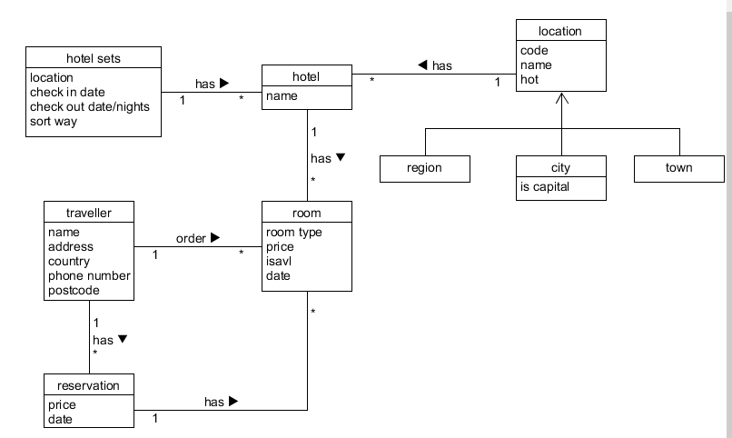
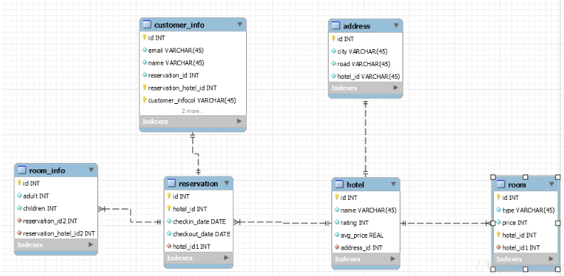

# 领域建模
+ a. 阅读Asg_RH文档,按用例构建领域模型。
   + 按Task2要求，请使用工具UMLet，截图格式务必是png并控制尺寸
   + 说明：请不要受PCMEF层次结构影响。你需要识别实体（E）和中介实体（M，也称状态实体）
       + 在单页面应用（如vue）中，E一般与数据库构建有关，M一般与store模式有关
       + 在java web应用中，E一般与数据库构建有关，M一般与session有关

    

+ b. 数据库建模（E-R模型）
   + 按Task3要求，给出系统的E-R模型（数据逻辑模型）
   + 建模工具PowerDesigner（简称PD）或开源工具OpenSystemArchitect
   + 不负责的连接[www.cnblogs.com/mcgrady/archive/2013/05/25/3098588.html](www.cnblogs.com/mcgrady/archive/2013/05/25/3098588.html)
   + 导出Mysql物理数据库的脚本
   + 简单叙说数据库逻辑模型与领域模型的异同
    
    

    Mysql脚本：  

    ```
    -- MySQL Script generated by MySQL Workbench
    -- Sun Apr 29 20:51:31 2018
    -- Model: New Model    Version: 1.0
    -- MySQL Workbench Forward Engineering

    SET @OLD_UNIQUE_CHECKS=@@UNIQUE_CHECKS, UNIQUE_CHECKS=0;
    SET @OLD_FOREIGN_KEY_CHECKS=@@FOREIGN_KEY_CHECKS, FOREIGN_KEY_CHECKS=0;
    SET @OLD_SQL_MODE=@@SQL_MODE, SQL_MODE='TRADITIONAL,ALLOW_INVALID_DATES';

    -- -----------------------------------------------------
    -- Schema mydb
    -- -----------------------------------------------------

    -- -----------------------------------------------------
    -- Schema mydb
    -- -----------------------------------------------------
    CREATE SCHEMA IF NOT EXISTS `mydb` DEFAULT CHARACTER SET utf8 ;
    USE `mydb` ;

    -- -----------------------------------------------------
    -- Table `mydb`.`address`
    -- -----------------------------------------------------
    CREATE TABLE IF NOT EXISTS        `mydb`.`address` (
  `id` INT NOT NULL AUTO_INCREMENT,
  `city` VARCHAR(45) NOT NULL,
  `road` VARCHAR(45) NOT NULL,
  `hotel_id` VARCHAR(45) NOT NULL,
    PRIMARY KEY (`id`))
    ENGINE = InnoDB;


    -- -----------------------------------------------------
    -- Table `mydb`.`hotel`
    -- -----------------------------------------------------
    CREATE TABLE IF NOT EXISTS `mydb`.`hotel` (
    `id` INT NOT NULL AUTO_INCREMENT,
    `name` VARCHAR(45) NOT NULL,
    `rating` INT ZEROFILL NOT NULL,
    `avg_price` REAL ZEROFILL NOT NULL,
    `address_id` INT NOT NULL,
    PRIMARY KEY (`id`),
    INDEX `fk_hotel_address1_idx`         (`address_id` ASC),
    CONSTRAINT `fk_hotel_address1`
    FOREIGN KEY (`address_id`)
    REFERENCES `mydb`.`address` (`id`)
    ON DELETE NO ACTION
    ON UPDATE NO ACTION)
    ENGINE = InnoDB;


    -- -----------------------------------------------------
    -- Table `mydb`.`reservation`
    -- -----------------------------------------------------
    CREATE TABLE IF NOT EXISTS `mydb`.`reservation` (
  `id` INT NOT NULL AUTO_INCREMENT,
  `hotel_id` INT NOT NULL,
  `checkin_date` DATE NOT NULL,
  `checkout_date` DATE NOT NULL,
  `hotel_id1` INT NOT NULL,
  PRIMARY KEY (`id`, `hotel_id`),
  INDEX `fk_reservation_hotel1_idx` (`hotel_id1` ASC),
  CONSTRAINT `fk_reservation_hotel1`
    FOREIGN KEY (`hotel_id1`)
    REFERENCES `mydb`.`hotel` (`id`)
    ON DELETE NO ACTION
    ON UPDATE NO ACTION)
    ENGINE = InnoDB;


    -- -----------------------------------------------------
    -- Table `mydb`.`customer_info`
    -- -----------------------------------------------------
    CREATE TABLE IF NOT EXISTS `mydb`.`customer_info` (
  `id` INT NOT NULL AUTO_INCREMENT,
  `email` VARCHAR(45) NOT NULL,
  `name` VARCHAR(45) NOT NULL,
  `reservation_id` INT NOT NULL,
  `reservation_hotel_id` INT NOT NULL,
  `customer_infocol` VARCHAR(45) NOT NULL,
  `reservation_id1` INT NOT NULL,
  `reservation_hotel_id1` INT NOT NULL,
  PRIMARY KEY (`id`, `customer_infocol`, `reservation_hotel_id`),
  INDEX `fk_customer_info_reservation1_idx` (`reservation_id1` ASC, `reservation_hotel_id1` ASC),
  CONSTRAINT `fk_customer_info_reservation1`
    FOREIGN KEY (`reservation_id1` , `reservation_hotel_id1`)
    REFERENCES `mydb`.`reservation` (`id` , `hotel_id`)
    ON DELETE NO ACTION
    ON UPDATE NO ACTION)
    ENGINE = InnoDB;


    -- -----------------------------------------------------
    -- Table `mydb`.`room`
    -- -----------------------------------------------------
    CREATE TABLE IF NOT EXISTS `mydb`.`room` (
  `id` INT NOT NULL AUTO_INCREMENT,
  `type` VARCHAR(45) NOT NULL,
  `price` INT NOT NULL,
  `hotel_id` INT NOT NULL,
  `hotel_id1` INT NOT NULL,
  PRIMARY KEY (`id`, `hotel_id`),
  INDEX `fk_room_hotel1_idx` (`hotel_id1` ASC),
  CONSTRAINT `fk_room_hotel1`
    FOREIGN KEY (`hotel_id1`)
    REFERENCES `mydb`.`hotel` (`id`)
    ON DELETE NO ACTION
    ON UPDATE NO ACTION)
    ENGINE = InnoDB;


    -- -----------------------------------------------------
    -- Table `mydb`.`room_info`
    -- -----------------------------------------------------
    CREATE TABLE IF NOT EXISTS `mydb`.`room_info` (
  `id` INT NOT NULL AUTO_INCREMENT,
  `adult` INT ZEROFILL NOT NULL,
  `children` INT ZEROFILL NOT NULL,
  `reservation_id` INT NOT NULL,
  `reservation_hotel_id` INT NOT NULL,
  `reservation_id2` INT NOT NULL,
  `reservation_hotel_id2` INT NOT NULL,
  PRIMARY KEY (`id`, `reservation_id`, `reservation_hotel_id`),
  INDEX `fk_room_info_reservation1_idx` (`reservation_id2` ASC, `reservation_hotel_id2` ASC),
  CONSTRAINT `fk_room_info_reservation1`
    FOREIGN KEY (`reservation_id2` , `reservation_hotel_id2`)
    REFERENCES `mydb`.`reservation` (`id` , `hotel_id`)
    ON DELETE NO ACTION
    ON UPDATE NO ACTION)
    ENGINE = InnoDB;


    SET SQL_MODE=@OLD_SQL_MODE;
    SET FOREIGN_KEY_CHECKS=@OLD_FOREIGN_KEY_CHECKS;
    SET UNIQUE_CHECKS=@OLD_UNIQUE_CHECKS;
    ```

    数据库逻辑模型与领域模型的异同：  

    同：都是将软件的概念类给图形化表示出来，都展现了各个概念类的名字、属性以及彼此之间的关系。   
    
    异：异： 领域模型主要面向需求，而数据库模型更多面向实际代码开发。数据库逻辑模型比领域模型更明确给出各个字段的类型，便于程序设计。 