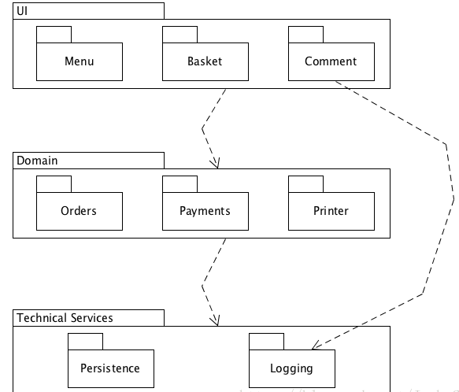

1. 描述软件架构与框架之间的区别与联系
    + 软件架构不是软件，而是关于软件如何设计的重要决策。软件架构决策涉及到如何将软件系统分解成不同的部分、各部分之间的静态结构关系和动态交互关系等。经过完整的开发过程之后，这些架构决策将体现在最终开发出的软件系统中；当然，引入软件框架之后，整个开发过程变成了“分两步走”，而架构决策往往会体现在框架之中。
    + 框架是一种特殊的软件，由实际的代码构建而成，它并不能提供完整无缺的解决方案，而是为你构建解决方案提供良好的基础，是软件系统、子系统的半成品。软件框架为具体的解决方案提供了基础，提供了基础服务和可扩展点，同时软件框架也建立了一些约束，开发人员在此基础上进行特定业务功能的定制开发。
    + 框架是具体语言和技术相关的，而架构与具体语言和技术无关。
    + 框架是集成了你的代码和多种第三方解决方案的工具，让你聚焦 业务逻辑代码 而 不是技术实现。
    + 软件架构是引导如何设计软件框架的重要决策。它决定了软件系统如何划分，在一定程度上描述了被划分的各个部分之间的静态、动态关系。软件架构的决策体现在软件系统的框架中。
2. 以你的项目为案例
    + 绘制三层架构模型图，细致到分区
        

    + 结合你程序的结构，从程序员角度说明三层架构给开发者带来的便利
        + 封装和分解了相关的复杂性，有利于提供开发效率。在我的程序中，显示菜单数据、处理订单数据和存储交易数据相互分开，数据流得到了有效组织和管理，从而大大减少了开发复杂度。
        + 通过逻辑划分，有利于开发者进行高效的团队开发。
        + 接口设计需要符合对扩展开发，对修改关闭的原则，增强了系统的安全性

3. 研究 VUE 与 Flux 状态管理的异同
    + 异： VUE 与 Flux 在状态管理上的差异主要体现在对数据流的管理方式不同。Flux 通过强制数据的单向流动来解决业务数据复杂度的问题。它主要将一个应用分成四个部分，视图层，动作，派发器，数据层。VUE 的状态管理由vuex实现。VUE 没有使用 Dispatcher 来接收 Actions 、执行回调函数并通知 Store 改变状态，而是通过使用 Mutation 来改变状态。
    + 同： Flux 思想是为了解决传统 MVC 架构不能有效解决大型业务中复杂数据流的管理问题而产生的一种软件架构思想。VUE 和 Flux 的状态管理都是基于 Flux 思想的有效实现，通过对数据流进行严格管理来规范数据在 Web 应用中流动方式的框架。