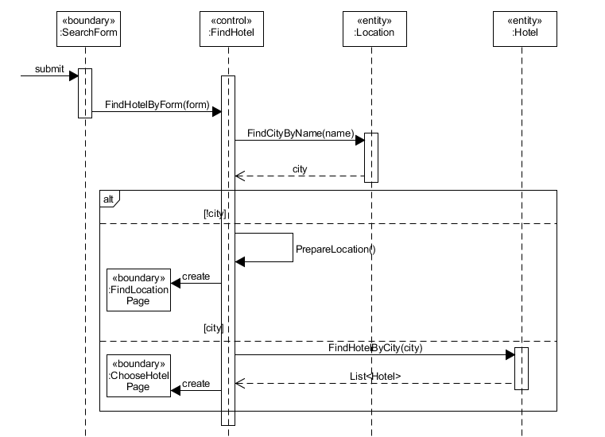
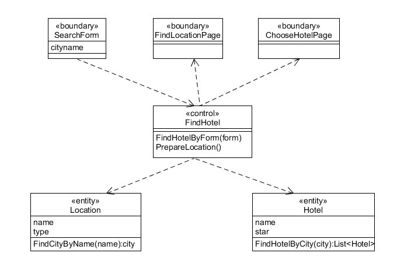
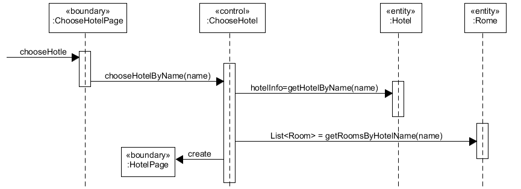
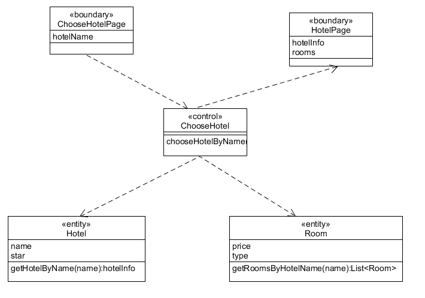
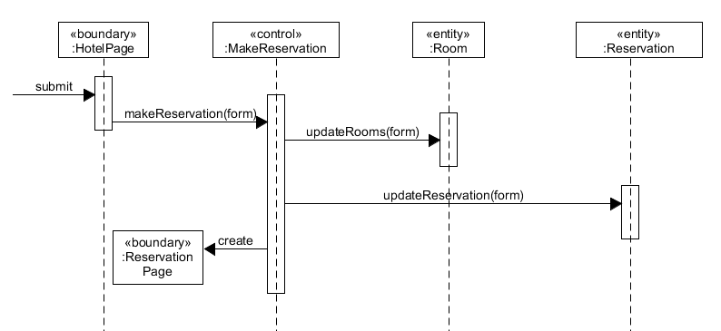
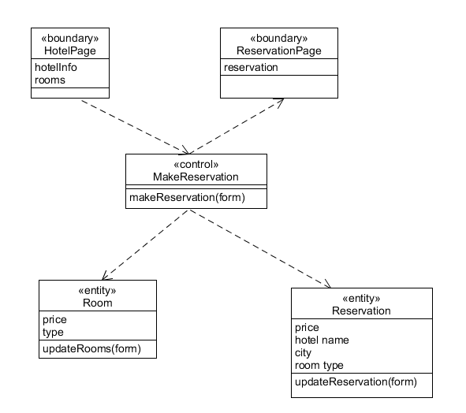
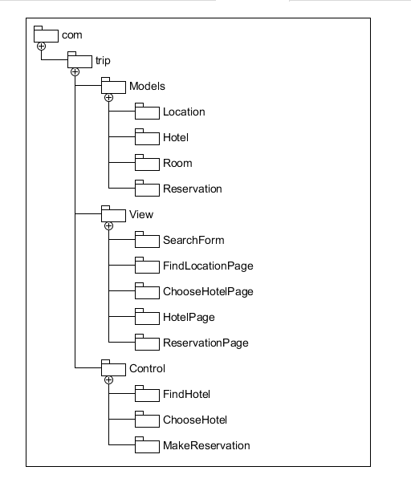

## 使用 ECB 实现 make reservation 用例的详细设计（包含用例简介，顺序图，类图）

1. search hotel
+ 用例简述： 用户提交查询表单，获得符合条件的旅馆列表
+ 顺序图：  
 
+ 类图：  
  

1. choose hotel
+ 用例简述：用户选择一个旅馆
+ 顺序图：  

+ 类图：  

1. make reservation
+ 用例简述： 用户选择房间类型和需要数量
+ 顺序图:  
 
+ 类图：   

## 将逻辑设计类图映射到实际项目框架的包图。用树形结构表述实现的包和类

